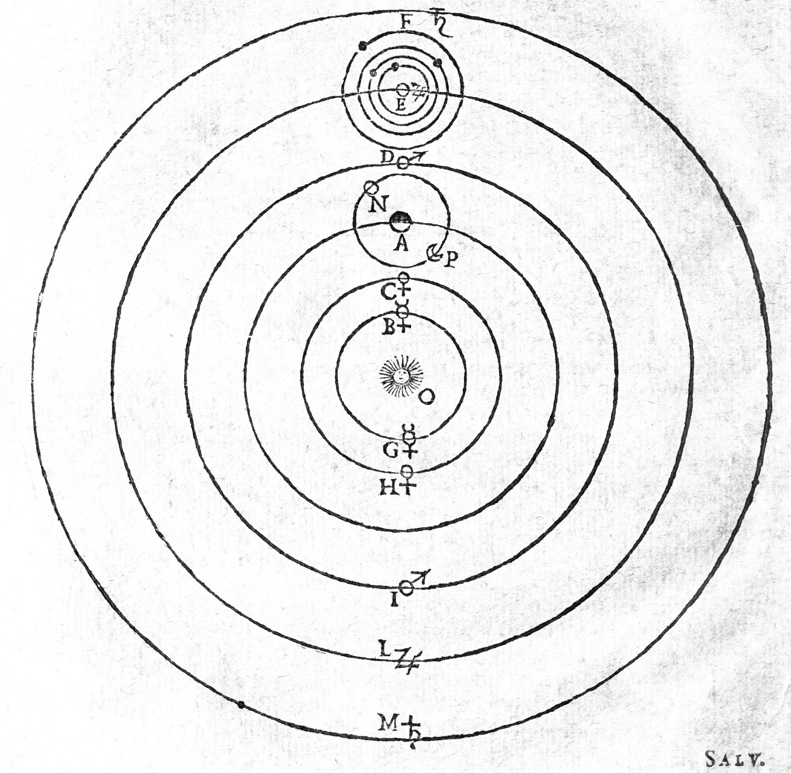

# Socratic Tutor

A RAG-powered tutor for philosophy of science that teaches by questioning — grounded in a corpus of Thomas Kuhn and Michael Polanyi so its responses stay faithful to the source texts rather than drifting into invention.

**Live app:** https://socratic-tutor-ascznqxqjn6mrpzqc6gopp.streamlit.app/

## What This Does

Most chatbots answer questions. This one asks them back. The student presents a thesis about the readings, and the tutor — modeled on the Oxbridge tutorial tradition — challenges them to defend it through probing questions, never handing over the answer. Because every response is grounded in retrieved passages from the actual source texts, the tutor stays anchored to what Kuhn and Polanyi actually wrote rather than fabricating claims, a common failure mode of ungrounded LLMs in education.

## How It Works

The course readings are chunked (~800-word chunks with 200-word overlap), embedded with a sentence-transformer model (all-MiniLM-L6-v2), and stored as a vector index. At query time, the student's claim is embedded and compared against the corpus using cosine similarity; the top three passages are injected into the prompt as grounding context. Generation runs through the Anthropic Claude API under a system prompt that enforces the Socratic style — one question at a time, every question tied to the retrieved text.

The vector store is built offline in ChromaDB and exported, so the deployed app performs retrieval in pure NumPy with no database dependency at runtime — keeping the Streamlit deployment lightweight. A per-session exchange cap controls API cost.

## Corpus

Thomas Kuhn, *The Structure of Scientific Revolutions* · Michael Polanyi, *Personal Knowledge*

## Stack

Python · Streamlit · sentence-transformers · NumPy · Anthropic Claude API (Haiku) · ChromaDB (offline index build)

## Built By

Neal Doran, Ph.D. | Bryan College | Doran Scientific Analytics
